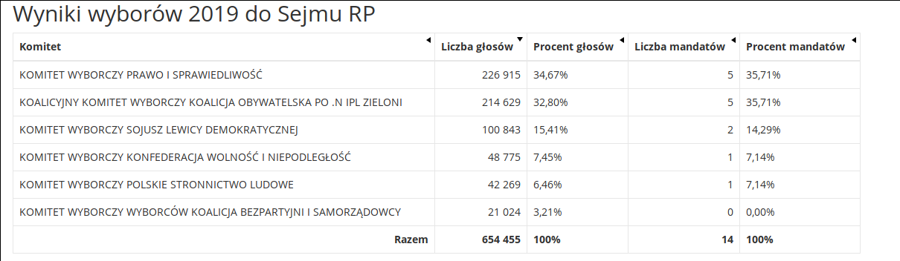
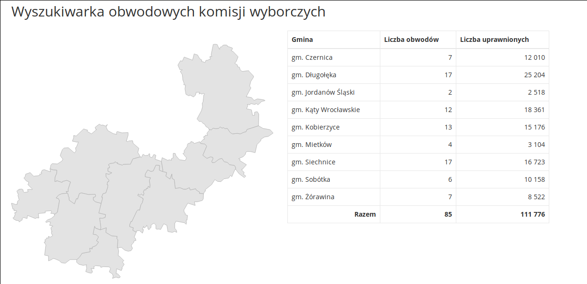

# Metoda d'Hondta

W metodzie d'Hondta dla każdego komitetu wyborczego, który przekroczył próg wyborczy, obliczane są kolejne ilorazy całkowitej liczby głosów uzyskanych przez dany komitet i kolejnych liczb naturalnych, czyli ilorazy wyborcze. 
O podziale miejsc pomiędzy komitetami decyduje kolejność na liście posortowanych ilorazów wyborczych.

Poniżej znajdują się wyniki zastosowania metody d'Hondta dla wyborów parlamentarnych z 2011 roku obliczone przy pomocy załączonego skryptu.

nr okregu | nazwa | PO | PSL | PiS | RPL | SLD | MN
-|-|-|-|-|-|-|-
1  |  Legnica |  5 |  0 |  4 |  1 |  2 |  0
2  |  Wałbrzych |  5 |  0 |  2 |  1 |  0 |  0
3  |  Wrocław |  9 |  0 |  4 |  1 |  0 |  0
4  |  Bydgoszcz |  6 |  1 |  3 |  1 |  1 |  0
5  |  Toruń |  6 |  1 |  4 |  1 |  1 |  0
6  |  Lublin |  4 |  2 |  6 |  2 |  1 |  0
7  |  Chełm |  3 |  2 |  5 |  1 |  1 |  0
8  |  Zielona Góra |  6 |  1 |  3 |  1 |  1 |  0
9  |  Łódź |  5 |  0 |  3 |  1 |  1 |  0
10  |  Piotrków Trybunalski |  2 |  1 |  4 |  1 |  1 |  0
11  |  Sieradz |  4 |  1 |  5 |  1 |  1 |  0
12  |  Kraków I |  4 |  0 |  4 |  0 |  0 |  0
13  |  Kraków II |  8 |  0 |  5 |  1 |  0 |  0
14  |  Nowy Sącz |  3 |  0 |  7 |  0 |  0 |  0
15  |  Tarnów |  3 |  1 |  5 |  0 |  0 |  0
16  |  Płock |  3 |  2 |  4 |  1 |  0 |  0
17  |  Radom |  3 |  1 |  4 |  1 |  0 |  0
18  |  Siedlce |  3 |  2 |  5 |  1 |  1 |  0
19  |  Warszawa I |  11 |  0 |  6 |  2 |  1 |  0
20  |  Warszawa II |  6 |  1 |  4 |  1 |  0 |  0
21  |  Opole |  6 |  0 |  3 |  1 |  1 |  1
22  |  Krosno |  3 |  1 |  6 |  1 |  0 |  0
23  |  Rzeszów |  4 |  1 |  8 |  1 |  1 |  0
24  |  Białystok |  5 |  1 |  6 |  1 |  1 |  0
25  |  Gdańsk |  8 |  0 |  3 |  1 |  0 |  0
26  |  Gdynia |  8 |  0 |  4 |  1 |  1 |  0
27  |  Bielsko-Biała |  5 |  0 |  3 |  1 |  0 |  0
28  |  Częstochowa |  3 |  0 |  2 |  1 |  1 |  0
29  |  Gliwice |  6 |  0 |  2 |  1 |  0 |  0
30  |  Rybnik |  5 |  0 |  3 |  1 |  0 |  0
31  |  Katowice |  7 |  0 |  3 |  1 |  1 |  0
32  |  Sosnowiec |  5 |  0 |  2 |  1 |  1 |  0
33  |  Kielce |  5 |  3 |  6 |  1 |  1 |  0
34  |  Elbląg |  4 |  1 |  2 |  1 |  0 |  0
35  |  Olsztyn |  5 |  1 |  2 |  1 |  1 |  0
36  |  Kalisz |  5 |  2 |  3 |  1 |  1 |  0
37  |  Konin |  3 |  1 |  3 |  1 |  1 |  0
38  |  Piła |  4 |  1 |  2 |  1 |  1 |  0
39  |  Poznań |  6 |  0 |  2 |  1 |  1 |  0
40  |  Koszalin |  4 |  0 |  2 |  1 |  1 |  0
41  |  Szczecin |  7 |  0 |  3 |  1 |  1 |  0

# Manipulacja wynikiem wyborów

Osobom mającym zamiar doprowadzić do przekłamania wyborów najczęściej przyświeca jeden z dwóch celów:
- maksymalizacja wyniku popieranej partii,
- minimalizacja wyniku partii, z którą sabotażysta się nie zgadza - najczęściej jest to partia wygrywająca sondaże

Będziemy rozważać dwie taktyki, mogące doprowadzić do osiągnięcia powyższych celów.

## Całkowita kontrola nad jednym z lokali wyborczych

W tym wypadku, mamy nieograniczoną kontrolę nad wynikiem wysłanym z lokalu do PKW.
Z danych PKW o wyborach do sejmu w 2019 i 2015 r. na jeden obwód przypada około 1096 uprawnionych do głosowania.
Rola przejętych glosów jest zatem zalezna od przyjętego celu.

### Poparcie wybranej partii

Jeżeli przejęte głosy zostaną przeznaczone na jedną z dużych partii, mają one marginalny wpływ. 
W okręgu wrocławskim dwa prowadzące ugrupowania zdobyły ponad 200 000 głosów, trzeci z kolei komitet miał na swoim koncie ponad stutysięczne poparcie.
Dla zwolennika któregokolwiek z tych ugrupowań fałszowanie wyborów w ten sposób jest nieopłacalne.

Sytuacja jest zgoła odmienna gdy zamierzamy poprzeć partię na granicy progu wyborczego.
Jak pokazuje załączony skrypt, tego typu ugrupowania potrzebują często jedynie kilkuset głosów aby zaszczycić parlament swoją prezencją.

Brakujące głosy do otrzymania 1 mandatu, 2019:

okręg wyborczy | partia	| liczba głosów
-|-|-
18	Siedlce	  |KON | 682
4	 Bydgoszcz	|KON | 1104
20	Warszawa	|KON  |1129
12	Kraków	  |LEW  |1276
19	Warszawa	|LEW  |1820
35	Olsztyn	  |KON | 2618

Brakujące głosy do otrzymania 1 mandatu, 2015:

okręg wyborczy | partia	| liczba głosów
-|-|-
23 Rzeszów       |PSL |54
6 Lublin         |KUK |955
11 Sieradz       |PET |1408
4 Bydgoszcz	     |PO  |2077
7 Chełm          |PSL |2092
27 Bielsko Biała |PO  |2292
 

Skuteczność tej taktyki w dużej mierze zależy od partii, którą popiera antagonista.

### Zmniejszenie wyniku partii prowadzącej w sondażach

Powyższe rozważania niosą również bardzo ciekawe wnioski dla osób chcacych obniżyć wynik liderów sondaży.
Okazuje się bowiem, że w metodzie d'Hondta wynik lidera jest znacznie gorszy gdy ugrupowań powyżej progu wyborczego jest więcej.
Łączna liczba mandatów zdobytych przez opozycję natomiast pozostaje taka sama.

Oznacza to, że w takim wypadku napastnik powinien przekazać głosy, które ma pod swoją kontrolą, na ugrupowanie będące na granicy przekroczenia progu wyborczego.

## Rozproszenie adwersarzy demokracji

Taki scenariusz jest obarczony dużo większym ryzykiem, ponieważ jedyne możliwości jakie posiadają agresorzy to unieważnianie kart do głosowania.
Jednak również to jest dość dużym wyzwaniem, ponieważ przy uniważnianiu kart wyborczych powinno być obecnych co najmniej dwóch członków komisji.
Zakładając jednak, że unieważnienie części głosów jest możliwe, rozważmy jakie szanse mają mąciciele.

Załóżmy, że każdy antydemokrata może unieważnić 5 głosów.
Bazując na danych z 2019 roku, organizacja dokonująca tego typu ataku jest w stanie unieważnić około 3000 głosów w przeciętnej wielkości okręgu wyborczym.

Jest to nieporównywalnie większy wpływ niż w przypadku przejęcia całego lokalu wyborczego jednak wciąż są to liczby marginalne względem liczby głosów oddanych na wygrywające partie.

### Poparcie wybranej partii

W tym wypadku (mając pewność, że wybrane ugrupowanie przekroczy próg wyborczy) najlepszą taktyką jest unieważnianie głosów przeznaczonych na ugrupowania będące blisko progu.
Strategia ta jest szczególnie skuteczna dla dużych ugrupowań i jest swojego rodzaju kontrą dla poprzedniego potencjalnego nadużycia.

### Zmniejszenie wyniku partii prowadzącej w sondażach

W tym celu taktyka wydaje się dość oczywista, wystarczy jedynie świadomie unieważniać głosy przeznaczone na komitet, którego wynik chcemy pogorszyć.

Skuteczność obu powyższych metod jest jednak mocno zalezna od zdolności napastników do niepostrzeżonego unieważniania kart.
Możliwości te niestety są niemożliwe do oszacowania.

## Przeciwdziałanie

W przypadku przejęcia całego lokalu, na niekorzyść napastników paradoksalnie działa niska frekwencja wyborców.
Niezgodność wyników z szacunkową frekwencją powinna spowodować dodatkowe kontrole lokalu i w razie wykrycia nieprawidłowości - unieważnienia wyborów.
Podobne zabezpieczenie można wprowadzić w przypadku rozproszenia agresorów na wszystkie lokale.
W takim wypadku powinno wprowadzić się próg liczby niewaznych głosów, który skutkowałby unieważnieniem całych wyborów.

Przed całkowitym przejęciem lokalu moga chronią również niezapowiedziane wizytacje z wyższych organów.

Kolejnym dużym zabezpieczeniem jest komisyjne sprawdzanie głosów, polegające na kolejnym niezależnym ocenianiu głosu na każdej karcie przez każdego członka komisji.
W takim modelu każdy członek komisji kolejno dokonuje inspekcji karty pod okiem reszty komisji i dopiero po przejściu pełnej "kolejki" ustalany jest werdykt i przechodzi się do kolejnej karty.
